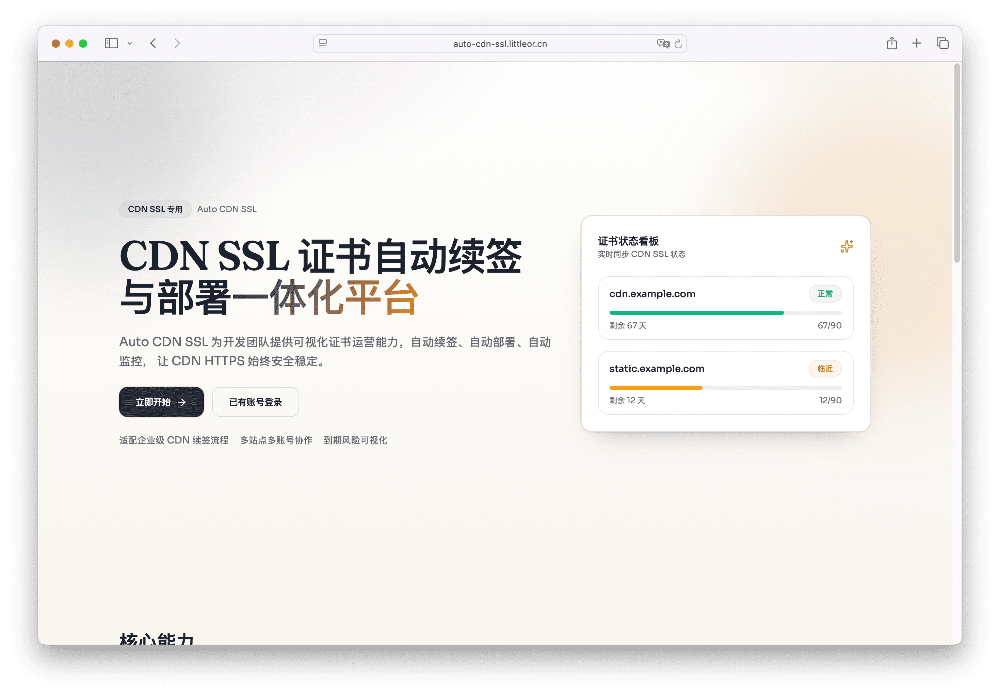
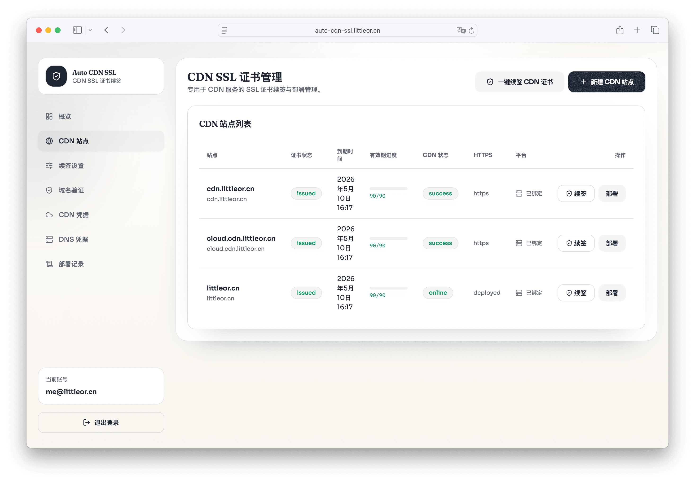

# Auto CDN SSL (auto-ssl)

English | [中文](./README.md)

A self-hosted SSL automation platform for CDN scenarios: **issue / renew / deploy** certificates in one place, so certificate expiry is no longer a “calendar reminder” problem.

- Certificate sources: Let’s Encrypt (ACME) / Self-signed (dev)
- Validation: HTTP-01 / DNS-01 (DNS-01 currently supports Tencent Cloud DNS)
- Deployment targets: Tencent Cloud CDN, Qiniu CDN




## What problem does it solve?

When you manage a large number of CDN domains, certificates become a reliability risk:

- Expiry dates are scattered across platforms
- Manual renew + upload is error-prone and easy to miss
- Failures are hard to diagnose (validation vs issuance vs deployment)

Auto CDN SSL turns the certificate lifecycle into an observable pipeline:

1. Renew ahead of expiry (threshold + schedule configurable)
2. Optionally auto-deploy renewed certificates to your CDN
3. Keep full history in the console: sites, certificates, job logs, deployments, and failure reasons

## Features

- **Centralized dashboard**: sites/domains, certificate expiry, jobs, deployments
- **Scheduled renewals + manual trigger**: renew on schedule, or run a one-off renew/deploy when needed
- **Domain validation** per apex domain: HTTP-01 / DNS-01
  - HTTP-01 endpoint: `/.well-known/acme-challenge/:token`
  - DNS-01: manages `_acme-challenge` TXT records (Tencent Cloud DNS)
- **CDN deployment**: deploy manually or automatically after renewal (Tencent Cloud CDN / Qiniu CDN)
- **Site sync**: import domains + HTTPS/certificate metadata from CDN providers to create/update sites
- **Security**: encrypt provider credentials and private keys at rest (AES-256-GCM, `DATA_ENCRYPTION_KEY`)
- **Multi-user auth**: signup/login/refresh token with SMTP email verification

## Quick start (self-hosted trial)

> This is for getting a working instance quickly. For production, see “Production deployment”.

### Prerequisites

- Node.js 20+
- MySQL 8+ (or MySQL-compatible service)
- SMTP server (required for signup email verification)

### 1) Install

```bash
yarn install
```

### 2) Configure

```bash
cp apps/backend/.env.example apps/backend/.env
cp apps/frontend/.env.example apps/frontend/.env
```

Backend `.env` minimum required:

- `MYSQL_*`
- `SMTP_*` + `FROM_EMAIL`
- `WEB_BASE_URL`
- `JWT_SECRET`
- `DATA_ENCRYPTION_KEY`

### 3) Run

```bash
yarn dev
```

- Console: `http://localhost:5173`
- API health: `http://localhost:4000/health`

## How to use (from the console)

1. Sign up, verify your email, and sign in
2. Create provider credentials:
   - CDN: `tencent` (Tencent Cloud CDN) / `qiniu` (Qiniu CDN)
   - DNS (optional): `tencent_dns` (for DNS-01)
3. Configure validation per apex domain:
   - HTTP-01: port `80` must be able to reach `/.well-known/acme-challenge/*`
   - DNS-01 (recommended): pick a Tencent DNS credential; the system writes TXT records and waits for propagation
4. Create a site, bind a CDN credential, and enable auto-renew (optional)
5. Trigger “Renew” and “Deploy”, or let the scheduler run automatically

Tip: DNS-01 is usually the easiest option for CDN domains (no dependency on exposing port 80).

## Production deployment

- PM2 + Nginx guide: [`docs/DEPLOY_PM2_NGINX.md`](./docs/DEPLOY_PM2_NGINX.md)

## Operational & security notes

- **Run a single backend instance**: the scheduler is built-in; multiple instances may trigger duplicate renewals.
- **Persist the ACME account key**: `apps/backend/data/acme-account.json` must be persisted/backed up in production.
- **Do not rotate keys casually**: changing `DATA_ENCRYPTION_KEY` will break decryption of existing secrets; changing `JWT_SECRET` will invalidate issued tokens.
- **Start with ACME staging**: point `ACME_DIRECTORY_URL` to staging first, then switch to production to avoid rate limits during initial setup.

## Docs

- Deployment: [`docs/DEPLOY_PM2_NGINX.md`](./docs/DEPLOY_PM2_NGINX.md)
- PRD (Chinese): [`docs/PRD.md`](./docs/PRD.md)

## Roadmap

Issues and PRs are welcome—especially new DNS/CDN providers and deployment options.
